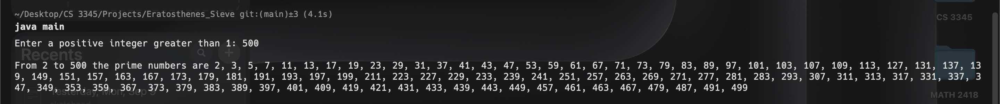

# Sieve of Eratosthenes

## Project Description

This is an implementation of an algorithm used to find all prime numbers up to a given limit. It starts with the smallest primt--2--and removes all multiples of 2 from the list of numbers before continuing to 3, 4, 5, etc. and repeating the same process until the value defined by the user is reached. Prime numbers are indexed by a boolean array, and the corresponding index is returned after the program is finished running.

## Java Version

```shell
openjdk version "22.0.2" 2024-07-16
```

## Usage

```shell
javac main.java
java main
```

## Sample Output


